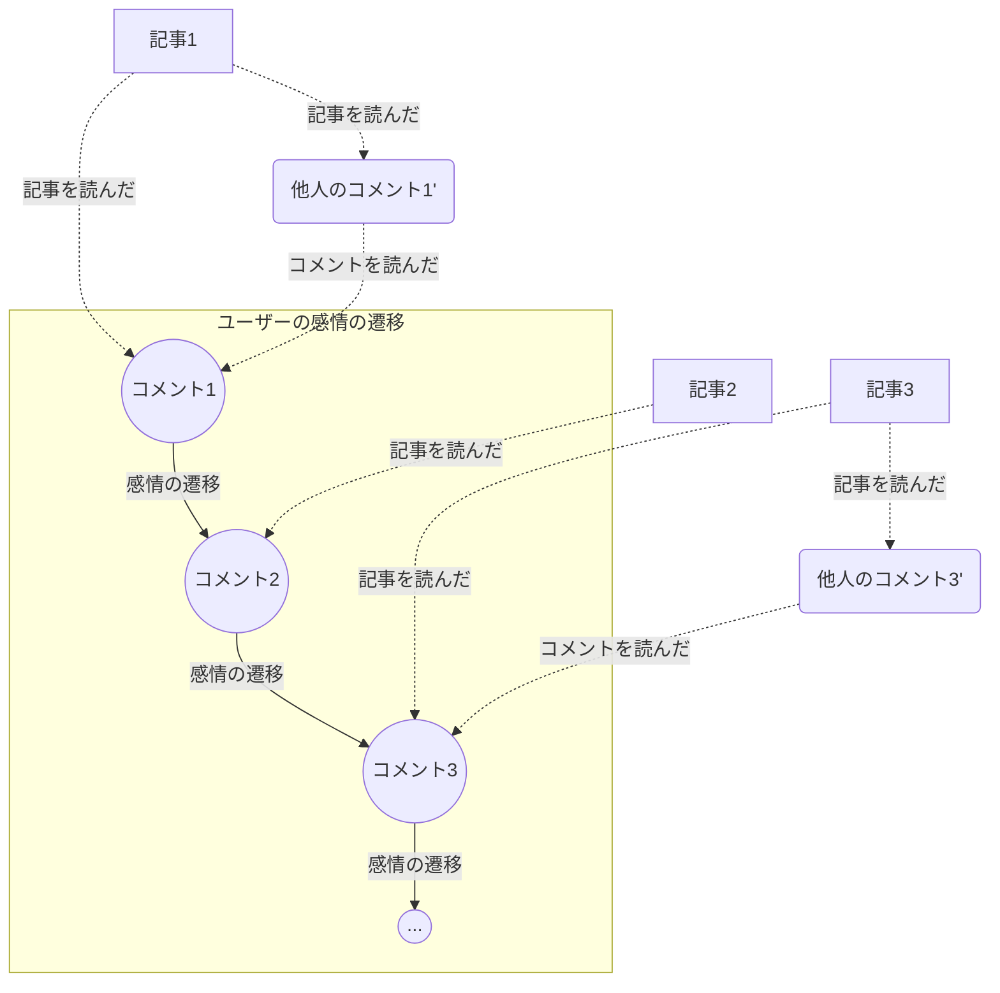

# ユーザーの感情変化のモデル

## 概要

記事やコメントを読むことで変化するユーザーの感情をモデル化する。まずは単純な定式化から始める。

## 解析対象

ある時刻に記事1（もしくは追加で別のユーザーのコメント1'）を読んだユーザーがコメント1を投稿する。また別の時刻に記事2（もしくは追加で別のユーザーのコメント2'）を読んだユーザーがコメント2を投稿する。記事や別のユーザーのコメント1,2...を読むことで変化すると考えられるコメント1,2...の挙動をモデリングする。

例えば以下のような状況である。別のユーザーのコメントはないこともある。

## 定式化

ユーザーの感情を $d$ 次元のベクトルで特徴量として表し、記事や他のユーザーからの影響で状態（$\simeq$ 感情）が遷移するモデルを構築する。

### 変数の定義

- ユーザーの状態
  - ユーザー $i$ の時刻 $k$ における感情を状態ベクトル $\mathbf{s}_{i, k} \in \mathbb{R}^d$ とする
  - 時刻 $k$ はユーザー固有のものであり、全ユーザーに対して同じ時刻であるとは限らない
- 記事の特徴量
  - ユーザー $i$ が時刻 $k$ に読んだ記事の特徴量を $\mathbf{p}_{i}^{(k)} \in \mathbb{R}^d$ とする
- 他人のコメントの特徴量
  - ユーザー $i$ が時刻 $k$ に読んだ他人のコメントの特徴量を $\mathbf{q}_{i}^{(k)} \in \mathbb{R}^d$ とする
  - 存在しないこともある
    - 0埋めではなく欠損値として扱う
    - 0埋めではすべてに中立であるという意味のようなものが含まれてしまうおそれがある
- 記事の影響度
  - 記事の影響度を示すパラメータを $\alpha_{i}^{(k)}$ とする
  - いいね数やコメント数などから計算した値を想定
- 他人のコメントの影響度
  - 他人のコメントの影響度を示すパラメータを $\beta_{i}^{(k)}$ とする
  - これも同様にいいね数やコメント数などから計算した値を想定

### 状態遷移のモデル

ユーザー $i$ の時刻 $k+1$ における状態 $\mathbf{s}_{i, k+1}$ は、時刻 $k$ における状態 $\mathbf{s}_{i, k}$ に加え、記事と他人のコメントの特徴量による影響を以下のように定式化する。

$$
\mathbf{s}_{i, k+1} = \tanh{\left(
  W_{i, p} \left( \alpha_{i}^{(k)} \mathbf{p}_{i}^{(k)} \right) + W_{i, q} \left( \beta_{i}^{(k)} \mathbf{q}_{i}^{(k)} \right) + W_{i, s} \mathbf{s}_{i, k} + \mathbf{b}_{i}
\right)}
$$

ここで：

- $W_{i, p} \in \mathbb{R}^{d \times d}$ は、記事の特徴量 $\mathbf{p}_{i}^{(k)}$ の影響をユーザーの状態に適用するユーザー $i$ 専用の重み行列。
- $W_{i, q} \in \mathbb{R}^{d \times d}$ は、他人のコメントの特徴量 $\mathbf{q}_{i}^{(k)}$ の影響をユーザーの状態に適用するユーザー $i$ 専用の重み行列。
- $W_{i, s} \in \mathbb{R}^{d \times d}$ は、ユーザー自身の状態の自己影響を示すユーザー $i$ 専用の重み行列。
- $\mathbf{b}_{i} \in \mathbb{R}^d$ は、ユーザー $i$ 固有のバイアス項。

この式は、ユーザーが読んだ記事や他人のコメントの影響、および自分自身の過去の状態が、次の状態にどのように反映されるかをモデル化している。

## 最適化方法

パラメータ $\{W_{i, p}, W_{i, q}, W_{i, s}, \mathbf{b}_{i}\}$ を最適化するために、観測データに基づき損失関数を最小化する。例えば、平均二乗誤差（MSE）を使用して次のように定義する。

$$
\text{Loss} = \sum_{k=1}^{T} \|\mathbf{s}_{i, k+1}^{\text{observed}} - \mathbf{s}_{i, k+1}^{\text{predicted}}\|^2
$$

ここで：

- $\mathbf{s}_{i, k+1}^{\text{observed}}$ は観測されたユーザー $i$ の状態
- $\mathbf{s}_{i, k+1}^{\text{predicted}}$ はモデルによって予測されたユーザー $i$ の状態
