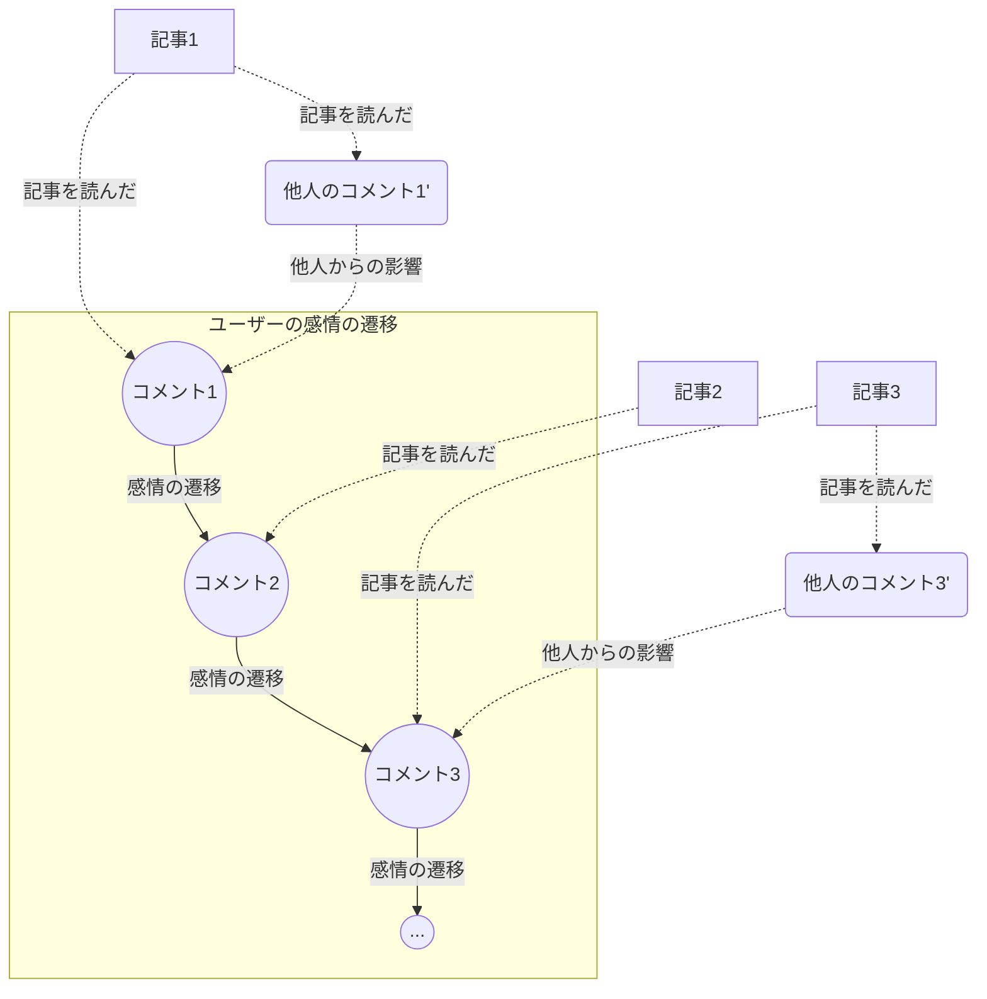

# ユーザーの感情変化のモデル

## 概要

記事やコメントを読むことで変化するユーザーの感情をモデル化する。まずは単純な定式化から始める。

## 解析対象

ある時刻に記事1（もしくは追加で別のユーザーのコメント1'）を読んだユーザーがコメント1を投稿する。また別の時刻に記事2（もしくは追加で別のユーザーのコメント2'）を読んだユーザーがコメント2を投稿する。記事や別のユーザーのコメント1,2...を読むことで変化すると考えられるコメント1,2...の挙動をモデリングする。

例えば以下のような状況である。別のユーザーのコメントはないこともある。

